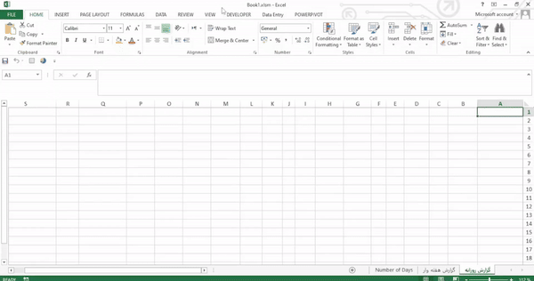
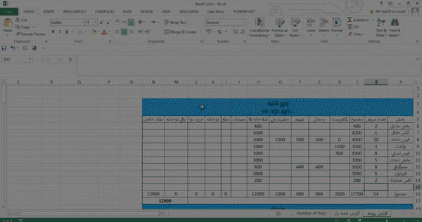

# اتوماسیون گزارش‌های روزانه و هفتگی بیمارستان

## بررسی کلی

این پروژه شامل یک ماکرو  است که برای اتوماسیون ایجاد گزارش‌های روزانه و هفتگی برای یک شفاخانه  طراحی شده است. این ماکرو یک جدول ساده برای گزارش‌های روزانه و یک جدول تجمیعی برای گزارش‌های هفتگی تولید می‌کند.

*نکته:* این ماکرو محدودیتی برای ایجاد یک جدول(یعنی هر روز فقط یک جدول) در هر روز دارد تا از دقت محاسبات و یکپارچگی داده‌ها اطمینان حاصل کند.

## تصاویر

**روزانه**  
**هفته وار**  

## ویژه گی ها

- -**ایجاد گزارش روزانه**: به‌طور خودکار یک جدول گزارش روزانه در فایل اکسل مشخص شده ایجاد می‌کند.
  -**ایجاد گزارش هفتگی**: در پایان هفته، می‌توان یک گزارش هفتگی از گزارش‌های روزانه ایجاد کرد.
  -**بررسی‌های یکپارچگی داده**: از افزودن بیش از یک جدول در هر روز جلوگیری می‌کند تا از اختلال در محاسبات جلوگیری شود.

## پیش نیاز ها

- مایکروسافت اکسل (با پشتیبانی از VBA)
- آشنایی پایه با فعال‌سازی ماکروها در اکسل

## طریقه نصب

1. Clone this repository to your local machine:
   `git clone https://github.com/yourusername/your-repo-name.git`
2. Open the Excel workbook where the macro will be implemented.
3. Create two excel sheets one by the name of گزارش روزانه and the other گزارش هفته وار
4. Enable the Developer tool
5. Press `ALT + F11` to open the VBA editor.
6. Insert a new module:

   * Right-click on any item in the Project Explorer.
   * Select `Insert` > `Module`.
7. Copy and paste the macro code into the module.
8. Save the workbook as a macro-enabled file (`.xlsm`).

## Usage

To use the macro:

1. Open the designated Excel file.
2. Press `ALT + F8` to open the Macro dialog box.
3. Select the macro for daily report generation and click `Run`.
